<div align="center">

# CausClass

### From classroom video to auditable temporal behavior graphs

A reproducible research framework that combines **video perception**, **LLM-guided graph search**, and **AERCA neural verification** to study temporal relationships between classroom behaviors.

[](https://github.com/longnt27/CausClass/actions/workflows/ci.yml)


[](LICENSE)

[Quick start](#quick-start) · [How it works](#how-it-works) · [Reproducibility](docs/reproducibility.md) · [Thesis report](report/README.md) · [Citation](#citation)

</div>

---

## What is CausClass?

CausClass is a research implementation for turning classroom video into behavior-share time series, searching over plausible temporal graph edits, and scoring candidate graphs with a neural verifier.

The project is designed to make the **software path inspectable and reproducible**: the reference workflow records seeds, configuration, package versions, input hashes, graph outputs, and metrics instead of producing only a final visualization.

| Stage | Role | Main output |
| --- | --- | --- |
| **Perception** | YOLO + ByteTrack extract tracked classroom behavior signals | behavior-share time series |
| **Initial graph** | AERCA/SENNGC estimates a dense temporal dependency structure | weighted baseline graph |
| **Graph search** | An LLM proposes structured edge additions/deletions | candidate graphs |
| **Verification** | Masked AERCA scores candidates on held-out selection data | ranked graph artifacts |
| **Interpretation** | Optional LLM pass summarizes the selected artifacts | observation report |
| **Provenance** | Research utilities record run metadata and input digests | reproducibility metadata |

## How it works

```mermaid
flowchart LR
    A[Classroom video] --> B[YOLO detections]
    B --> C[ByteTrack tracks]
    C --> D[Behavior-share time series]
    D --> E[AERCA dense baseline]
    E --> F[LLM graph-edit proposals]
    F --> G[Masked AERCA scoring]
    G --> H[Reviewed graph artifacts]
    H -. optional .-> I[LLM observation report]
```



The maintained public graph convention is **source row → target column**. Conversion to SENNGC's internal coefficient convention happens only at the verifier boundary and is regression-tested. See [architecture.md](docs/architecture.md) for the software contract.

> [!IMPORTANT]
> **CausClass studies temporal predictive structure, not intervention-level causation.** A graph edge does not establish a causal mechanism, a student's internal state, or a basis for high-stakes decisions. Protocol v2 also contains result-changing corrections relative to the historical thesis implementation; old thesis tables should be rerun before comparison. See the [reproduction protocol](docs/reproducibility.md).

## Quick start

The fastest path exercises the real verifier on CPU with **no video, GPU, API key, or paid service**.

### Requirements

- Python **3.11–3.13**
- [`uv`](https://docs.astral.sh/uv/)

```bash
git clone https://github.com/longnt27/CausClass.git
cd CausClass

uv sync --locked --extra dev
uv run --no-sync causclass-smoke --output-dir output/smoke-001 --seed 42
uv run --no-sync pytest --cov
```

The smoke run generates a small deterministic VAR fixture and performs real dense + masked AERCA training on CPU. It writes:

```text
output/smoke-001/
├── time_series.csv
├── ground_truth_graph.json
├── graph.json
├── metrics.json
├── config.json
└── run_metadata.json
```

`run_metadata.json` records the protocol, seed, Git state, package versions, and SHA-256 digests of the input artifacts. The smoke F1 is a **software integration check, not a benchmark result**. Existing output directories are rejected so experiment records are not silently overwritten.

## Run the full research pipeline

Install the optional runtime groups you need:

```bash
uv sync --locked \
  --extra dev \
  --extra llm \
  --extra vision \
  --extra tracking \
  --extra dashboard

cp .env.example .env
```

Then run video → graph discovery:

```bash
uv run --no-sync python -m core.end_to_end_pipeline \
  --video /path/to/consented-classroom.mp4 \
  --model data/best.pt \
  --output_dir output/runs/classroom-001 \
  --skip_teacher_advice
```

Or run the stages independently:

```bash
# Video -> behavior time series
uv run --no-sync python -m data.extract_video_dynamics /path/to/consented-classroom.mp4 \
  --model data/best.pt \
  --output-dir output/phase1/classroom-001

# Existing CSV -> temporal graph
uv run --no-sync python -m core.run_causal_discovery \
  --input output/phase1/classroom-001/classroom_multivariate_timeseries.csv \
  --output output/final_causal_graph.json
```

The maintained behavior ontology for standalone CSV discovery is:

```text
Talk, Read, Phone, Write, Lean, Bow
```

optionally preceded by `time_bin_sec`.

### External services

- `DEEPSEEK_API_KEY` — graph-edit proposals and optional observation reports.
- `GEMINI_API_KEY` — synthetic-data generation workflows.
- `WANDB_MODE=disabled` — recommended unless experiment telemetry has been explicitly approved.

External-provider commands can incur charges and transmit data outside your machine. Environment variables take precedence over values in `.env`.

## Reproducible research workflow

CausClass separates **software validation** from **scientific reproduction**.

### What CI validates

The GitHub Actions research workflow checks:

- locked installs on Python 3.11, 3.12, and 3.13;
- linting and regression tests;
- a deterministic CPU verifier smoke run;
- source and wheel builds, including an installed-wheel smoke test outside the checkout;
- optional vision/runtime imports and CLI entry points;
- a clean thesis PDF build with unresolved citation/reference checks;
- a non-root Docker image running the smoke workflow with `--network none`.

### What still requires a real research run

A passing CI build does **not** reproduce the thesis experiments. For reportable results, retain the exact commit, seed, split, preprocessing, configuration, provider/model IDs, input/model checksums, environment lock, prompts/responses when applicable, metrics, and failed attempts.

Protocol v2 intentionally fixes graph direction handling, Gaussian KL calculation, graph-selection leakage, baseline edge boundary cases, and ontology consistency. Read [docs/reproducibility.md](docs/reproducibility.md) before comparing new output with historical results.

## Container

Build the CPU reference image:

```bash
docker build -t causclass:research .
docker run --rm --network none causclass:research
```

The container runs as a non-root user and executes the API-free smoke workflow. It does not bundle private classroom videos or the detector checkpoint. Mount a writable directory at `/results` if you want to retain generated artifacts.

## Artifact viewer

```bash
uv run --no-sync streamlit run app.py
```

`app.py` is a **local viewer for completed pipeline artifacts**. It is intentionally not presented as a production video-inference service.

## Thesis report

The complete Vietnamese thesis source, figures, appendices, and bibliography from the original `CausClass-report` repository are preserved under [`report/`](report/README.md), including source provenance.

Build it from the repository root with:

```bash
make report
```

The generated PDF is written to `report/build/main.pdf`. CI also builds the report and uploads the PDF and complete build log.

> [!NOTE]
> The thesis is a historical research document. Importing it into this repository does not retroactively turn its reported measurements into protocol-v2 results.

## Repository map

```text
CausClass/
├── core/                  # graph search, verifier, experiments, smoke CLI
│   ├── models/            # adapted AERCA / SENNGC model code
│   └── legacy/            # historical runners retained for traceability
├── data/                  # perception and synthetic-data utilities
├── utils/                 # graph, path and reproducibility helpers
├── tests/                 # API-free regression + CPU integration tests
├── docs/                  # architecture, reproducibility and ethics notes
├── report/                # imported thesis source and provenance
├── refs/                  # retained third-party reference papers
├── app.py                 # local artifact viewer
├── pyproject.toml         # package and optional dependency groups
├── uv.lock                # resolved CPU reference environment
├── Dockerfile             # non-root CPU research image
└── CITATION.cff           # software citation metadata
```

## Research scope and responsible use

Classroom video can contain sensitive personal data. Use only data you are authorized to process, document consent/access conditions, and review [docs/data-and-ethics.md](docs/data-and-ethics.md) before redistributing images, detector weights, derived datasets, or third-party publications.

Observational video, behavior-share compositionality, detection errors, omitted variables, camera changes, temporal aggregation, and LLM proposal bias can all affect the resulting graph. CausClass is a research tool for analysis and experimentation—not an automated system for grading, discipline, diagnosis, or other high-stakes decisions about students.

## Development

Before changing scientific behavior, read [CONTRIBUTING.md](CONTRIBUTING.md) and the [reproduction protocol](docs/reproducibility.md).

```bash
uv sync --locked --extra dev
make lint
uv run --no-sync pytest --cov
```

Existing `python -m core...` and `python -m data...` entry points are intentionally retained to avoid breaking experiment commands.

## Citation

If you use CausClass, cite the software using [`CITATION.cff`](CITATION.cff), record the exact commit, and cite the original AERCA work used by the verifier:

```bibtex
@inproceedings{han2025root,
  title={Root Cause Analysis of Anomalies in Multivariate Time Series through Granger Causal Discovery},
  author={Xiao Han and Saima Absar and Lu Zhang and Shuhan Yuan},
  booktitle={The Thirteenth International Conference on Learning Representations},
  year={2025},
  url={https://openreview.net/forum?id=k38Th3x4d9}
}
```

## License and third-party material

The repository retains its existing [MIT license](LICENSE). Adapted AERCA/SENNGC code, reference papers, datasets, images, and model weights may carry separate provenance or redistribution requirements. See [THIRD_PARTY_NOTICES.md](THIRD_PARTY_NOTICES.md) before reuse or redistribution.
